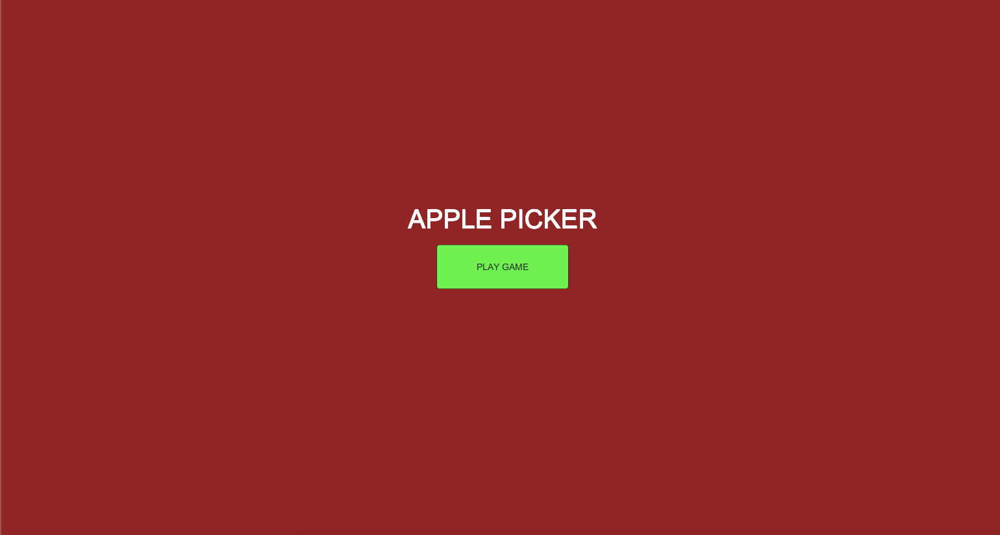
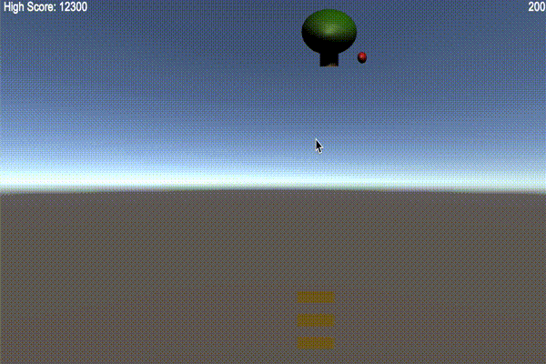
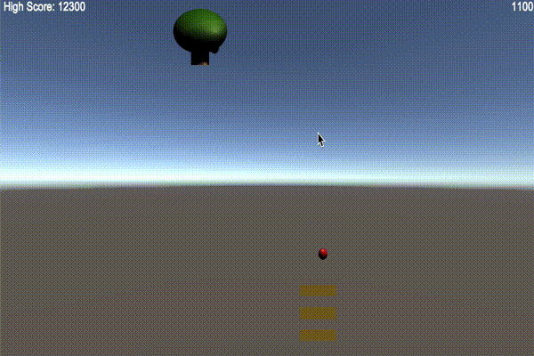
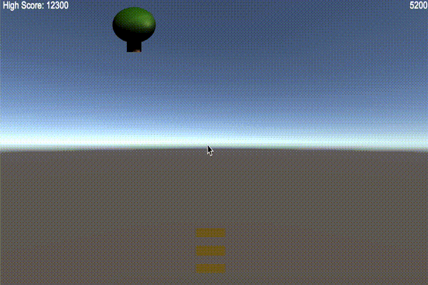
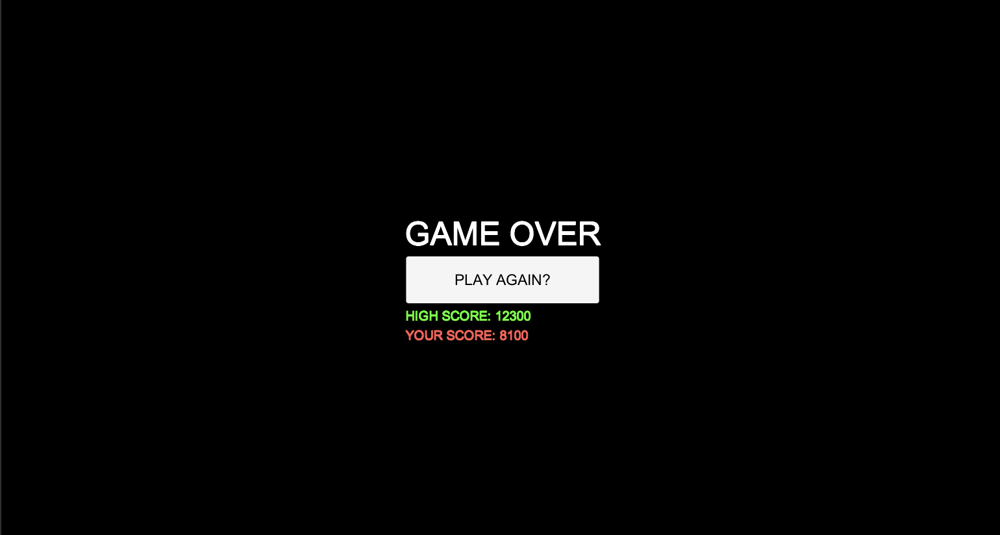

# ApplePicker

## Project Overview
ApplePicker is a simple physics game developed in Unity with the C# language. Designed and codedas a homework for my CSC476 Game Design class,
the objective of the game is to catch apples which are falling from a moving tree with your baskets. You get three baskets to start, miss an apple and you lose a basket.
As the game goes on, increasingly fast and more difficult to catch apples drop.

## Screen Shots

*Home Screen*  


*Easy Apple*  



*Medium Apple*  



*Hard Apple*  



*Game Over*  


## Important Features and Code

Some of the more important features/tasks to complete in the coding of this game was the increasing difficulty of the apple over the course of the game, the trees movement, along with highscore tracking with UI Presentation.
Enhanced replayability was the intention of all of these features, along with learning to manipulate settings in Unity. Below are code snippets of how these features were achieved.

*Increasing difficulty (found in /Assets/Scripts/AppleTree.cs)*
```
    public float secondsBetweenAppleDrops = 1f;
    
    ...
    
    // Start is called before the first frame update
    void Start()
    {
        Invoke("DropApple", 2f);
    }

    void DropApple()
    {
        int rand = Random.Range(1,9);
        if((medium == false && hard ==false) || rand < 4 ){
            GameObject apple = Instantiate<GameObject>(applePrefab);
            apple.transform.position = transform.position;
        }
        else if (medium && (rand < 7||(rand > 6 && !hard))){
            GameObject apple = Instantiate<GameObject>(appleMediumPrefab);
            apple.transform.position = transform.position;
        }
        else if (hard&& rand>6){
            GameObject apple = Instantiate<GameObject>(appleHardPrefab);
            apple.transform.position = transform.position;

        }
        Invoke("DropApple", secondsBetweenAppleDrops);
    }
```

*Tree Movement (found in Assets/Scripts/AppleTree.cs)
```
    public float speed = 1f;
    public float leftAndRightEdge = 10f;
    public float chanceToChangeDirections = 0.1f
    // Update is called once per frame
    void Update()
    {
        Vector3 pos = transform.position;
        pos.x += speed * Time.deltaTime;
        transform.position = pos;

        if (pos.x < -leftAndRightEdge) {
            speed = Mathf.Abs(speed);
        } else if (pos.x > leftAndRightEdge) {
            speed = -Mathf.Abs(speed);
        }
    }
    void FixedUpdate()
    {
        if (Random.value < chanceToChangeDirections){
            speed *= -1;
        }
    }
}
```

*High Score (found in /Assets/Scripts/HighScore.cs)*

```
public class HighScore : MonoBehaviour
{
    static public int score = 1000;
    static public bool newScore = false;
    void Awake()
    {
        if(PlayerPrefs.HasKey("HighScore")){
            score = PlayerPrefs.GetInt("HighScore");
        }
        PlayerPrefs.SetInt("HighScore", score);
    }
...
    // Update is called once per frame
    void Update()
    {
        Text gt = this.GetComponent<Text>();
        gt.text = "High Score: "+score;
        if (score > PlayerPrefs.GetInt("HighScore")){
            PlayerPrefs.SetInt("HighScore", score);
        }
    }
}
```
* UI Management (found in Assets/Scripts/UIManager.cs)
```
    public Text highScore;
    public Text yourScore;
    public Text beatHighScore;

    /// Start is called on the frame when a script is enabled just before
    /// any of the Update methods is called the first time.
    /// </summary>
    void Start()
    {
        // high score controls
        highScore.text = "HIGH SCORE: ";
        int h_score = 0;
        if(PlayerPrefs.HasKey("HighScore")){
            h_score = PlayerPrefs.GetInt("HighScore");
            highScore.text += h_score.ToString();
        }

        // your score controls
        yourScore.text = "YOUR SCORE: ";
        int y_score;
        y_score = Basket.scoreNum;
        yourScore.text += y_score.ToString();

        // Beat high score?
        if (y_score == h_score){
            beatHighScore.text = "YOU SET THE HIGH SCORE";
        }
    }
```

*Interested in playing the game? Try it out on the soon to be deprecated UnityConnect WebGL player here: https://play.unity.com/mg/other/untitled-31570*

